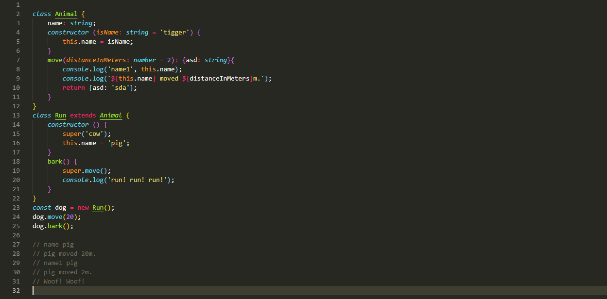

# 记class

## 基础内容
  class,是es6中提出的，类的概念。
  * 一个简单的例子
```
    class Widget {
      constructor(width,height) {
        this.width = width || 50;190 ｜ 附录 A
        this.height = height || 50;
        this.$elem = null;
      } 
      render($where){
        if (this.$elem) {
          this.$elem.css( {
          width: this.width + "px",
          height: this.height + "px"
          } ).appendTo( $where );
        }
      }
      } 
      class Button extends Widget {
        constructor(width,height,label) {
        super( width, height );
        this.label = label || "Default";
        this.$elem = $( "<button>" ).text( this.label );
      } 
      render($where) {
        super( $where );
        this.$elem.click( this.onClick.bind( this ) );
      } 
      onClick(evt) {
        console.log( "Button '" + this.label + "' clicked!" );
      }
    }
```
  * 注意
  1. Demo中的constructor方法是构造方法，this关键字则代表实例对象。也就是说，ES5的构造函数Demo，对应ES6的Demo这个类的构造方法。
  2. 定义"类"的方法的时候，前面不需要加上function这个关键字，直接把函数定义放进去了就可以了。另外，方法之间不需要逗号分隔，加了会报错。
  * constructure方法
    1. constructure方法时class的默认方法，在通过new实例化class时，会默认调用这个方法，如果一个类没有显示定义这个方法，会有一个    默认的空的constructure方法呗添加调用
    2. constructor方法默认返回实例对象（即this）,完全可以指定返回另外一个对象；
  * super
    1. super作为函数调用时，代表父类的构造函数。ES6 要求，子类的构造函数必须执行一次super函数。
    2. super作为对象时，在普通方法中，指向父类的原型对象；在静态方法中，指向父类
  * 类相当于实例的原型，所有在类中定义的方法，都会被实例继承。如果在一个方法前，加上static关键字，就表示该方法不会被实例继承，而    是直接通过类来调用，这就称为“静态方法”。
## 优缺点
  * 在class之前我们，通过.prototype来实现一些继承和委托，那class解决了哪些问题呢？  
    1. 不再引用杂乱的 .prototype 了。
    2. Button 声 明 时 直 接“ 继 承 ” 了 Widget， 不 再 需 要 通 过 Object.create(..) 来 替换 .prototype 对象， 也不需要设置 .__proto__ 或者 Object.setPrototypeOf(..)。
    3. 可以通过 super(..) 来实现相对多态， 这样任何方法都可以引用原型链上层的同名方法。 这可以解决构造函数不属于类， 所以无法互相引用——super() 可以完美解决构造函数的问题。
    4. class 字面语法不能声明属性（只能声明方法）。 看起来这是一种限制， 但是它会排除掉许多不好的情况， 如果没有这种限制的话， 原型链末端的“实例” 可能会意外地获取其他地方的属性（这些属性隐式被所有“实例” 所“共享”）。 所以， class 语法实际上可以帮助你避免犯错。
    5. 可以通过 extends 很自然地扩展对象（子） 类型， 甚至是内置的对象（子） 类型， 比如Array 或 RegExp。 没有 class ..extends 语法时， 想实现这一点是非常困难的， 基本上只有框架的作者才能搞清楚这一点。 但是现在可以轻而易举地做到！

  * class存在的问题
    1. 首先，es6中的class不像传统语言中的class是完全复制父类的所有行为，而是一个prototype实时委托的一个语法糖，所以当我们修改了父类中的一些方法时，我们子类的也会一同修改。
    2. es6中的class不能定义属性（只能定义方法），如果你想要定义属性，那么只能通过prototype语法例如：
    这种方法的问题是，违背了我们定义class的本意，我们定义class是想要通过定义类来使我们能够直接获取父类的属性，泄露了prototype。
    ```
    class C {
      constructor() {
        // 确保修改的是共享状态而不是在实例上创建一个屏蔽属性！
        C.prototype.count++;
        // this.count 可以通过委托实现我们想要的功能
        console.log( "Hello: " + this.count );
      }
    } 
    // 直接向 prototype 对象上添加一个共享状态
    C.prototype.count = 0;
    var c1 = new C();
    // Hello: 1
    var c2 = new C();
    // Hello: 2
    c1.count === 2; // true
    c1.count === c2.count; // true
    ```
    3. 还有就是当属性名称与方法名一样时，会默认调用属性。
    4. 还有问题现在还没弄清楚，先不写了，就是super（）的静态绑定。

### 实例说明(typescript)


* 直接写说明好了
1. 首先定义了Animal类, 构造函数里面添加了一个属性name,默认是tigger, 里面有个方法move,默认2米,返回值asd.
2. 定义一个类Run,继承自Animal, 构造函数中执行super(es6要求子类的构造函数必须执行一次super,否则报错),意义在于**继承父类的this**对象,对其进行加工,super代表父类的构造函数. 虽然代表父类构造函数但是,返回到是子类的实例, 所以super内部的this指向子类.里面有个bark方法
* 答案解析
1. 执行move方法时候,我们传入20,所以移动20,我们在super中传入了cow,但是为什么最后是pig,原因其实就是我super指向的是父类的构造函数但是绑定的是子类的this,然后我们子类复制pig就会用于父类的函数.
2. 执行dark时候,super作为一个对象,代表父类的构造函数,执行了父类构造函数的move方法,没有传入,所以就用之前定义的默认的2, pig原因同上。。