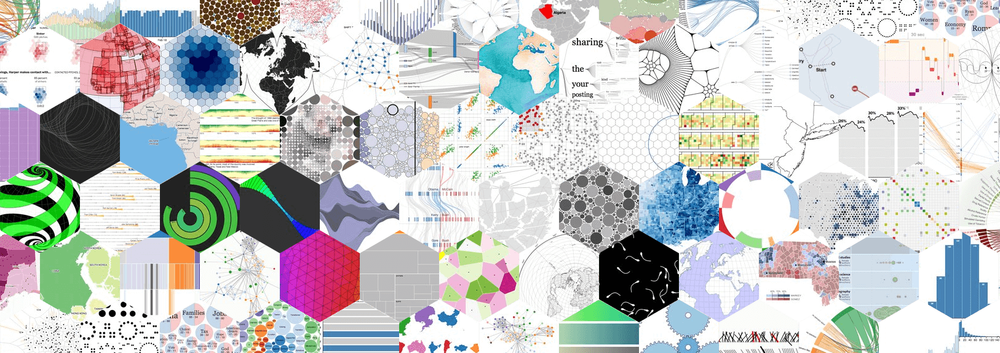

### D3.js介绍

#### 简介： 
* 是什么
D3是一个常用于可视化的js库。主要是对Dom操作封装，提供了很多api，很像jQuery（选中元素，建立集合，操作Dom）。
* 核心
D3的核心是将数据与可视化元素进行匹配，一一对应，通过数据的改变从而改变对应可视化元素的属性，封装了一些过程。使用HTML，SVG和CSS将数据以非常直观的方式呈现出来。
* 优点
1. 图表类型非常丰富，几乎可以满足所有开发需求。
2. 用echarts和highcharts解决不了需求的时候用D3自己撸一个，比较自由，想做成什么样就做成什么样。
3. 支持事件处理器。

#### 开始
