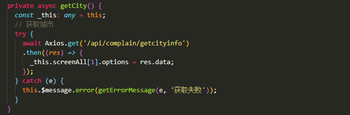
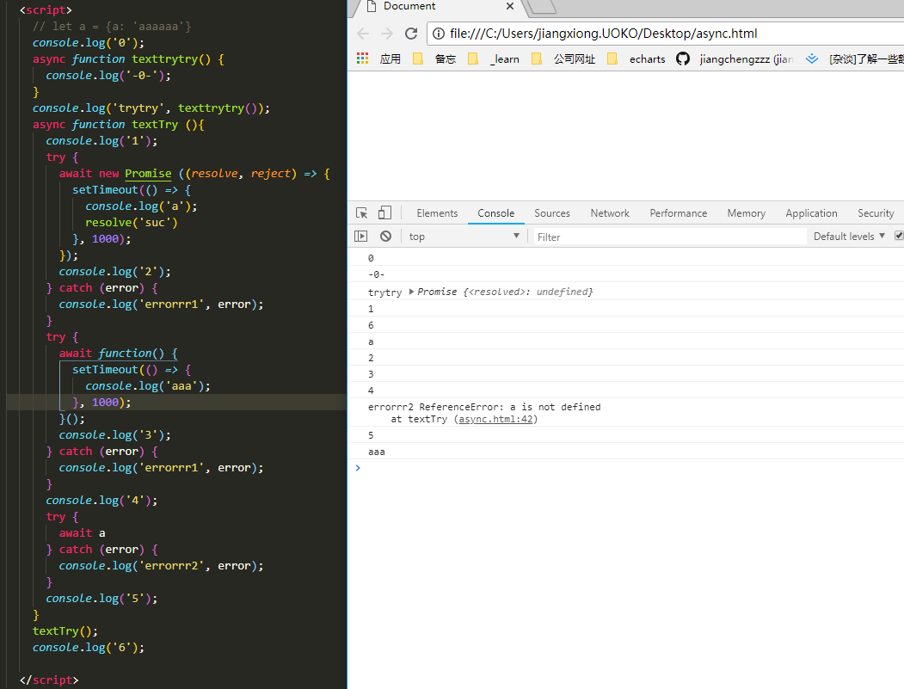

## 利用aysnc await进行错误捕获

### 前言
之前一直没有很注重前端错误捕获这块的东西，最近开发开始进行异常监控。所以记录一下。
前端异常处理，除开一些框架，常用有两种方式：
> 1.一种是window.onerror:
> 写法 window.onerror = function(message, source, lineno, colno, error) { ... }，这种方式不是很了解
> 2.还有一种是利用try catch进行处理
> 写法： try{}catch(error){} try中写入想要执行的代码，catch里面写入try中代码执行异常时执行的代码。
对比： 利用try catch只能捕获到运行时的非异步错误 ，对于语法错误和异步错误就不能捕捉到，虽然语法错误一般利用编辑器和eslint很容易捕捉到，基本不会出现。 onerror 比try catch强一点无论是异步还是非异步都能捕捉到

### 目前我们采用的是 aysnc await 结合try catch的方式
这是在业务中的代码

* 上面代码利用async创建一个异步函数，
* 执行try中请求，如果请求成功那么会执行.then中代码如果，不成功，就会将错误信息抛出，catch将其捕获，提示信息。
* 说明一下：axios.get()会返回一个promise对象

### 解析两者结合的方式

async/await文档总结
> 1. async函数会返回一个promise对象，promise，**总会返回**，也就是说，不管你return的是一个promise还是一个普通对象,如果不是就包装成promise，不管你是否有return，如果没有就会返回一个resolved的值为undefined的promise。
> 2. await是一个关键字，只能在async定义的函数中使用，它可以让async这个函数内的js代码在这暂停直到promise执行并且返回结果，才会继续向下, 若非Promise，则不会拦截后面代码执行。当promise对象resolve过后并且执行完then里面的代码，就执行下一步代码，不resolve不会触发下一行代码执行。
> 3. 如果await得到了一个带有then方法的非promise对象，它将会调用提供原生函数resolve、reject作为参数的方法，然后await一直等待，直到他们其中的一个被调用

来了！来了！
;
> 描述一下执行结果：直接打印的是前六个，一秒后打印后六个，再过了一秒打印aaa。

1. 首先根据打印顺序前三行，这是说明不管是否有return都会返回一个promise。
2. 直接打印了前六个，那么可以得出的结论：async定义的函数，如果没有await，并不会异步去执行，所以从上至下打印0，-0-，trytry Promise {<resolved>: undefined},1,6.
3. 然后一秒后打印a，2,3,4，errorrr2 先打印的是a说明当函数执行第一个try时候，后面所有次async函数中的代码都暂停执行，当promise的resolve方法执行完后才能，执行后面的代码（如果没有调用resolve方法。那么后面的代码将一直不执行）
4. 打印a，2,3,4，errorrr2过后一秒打印aaa说明，当我们await的不是一个promise时候。不会阻断后面代码执行，所以此时的settimeout不会向上一个一样，等时间过了以后执行后面的代码。
5. 最后一个try catch 报错，显而易见，a未定义并且，错误信息在catch被捕获。

### 线上压缩后代码的错误捕获
> 线上的代码都是经过webpack打包过的，当我们收到 a is not defined的时候， 这种错误显然时无效的，那我们如何去捕获线上代码的错误呢
1. 第一个方案时利用sourcemap定位到错误代码的具体位置， 

## 结论：
1. async的最大作用其实是不论怎样都会返回一个promise对象，然后给await提供一个环境。
2. await是套装异步的关键，解决回调问题的关健，同事下班了，我也想走了，思维一片混乱。