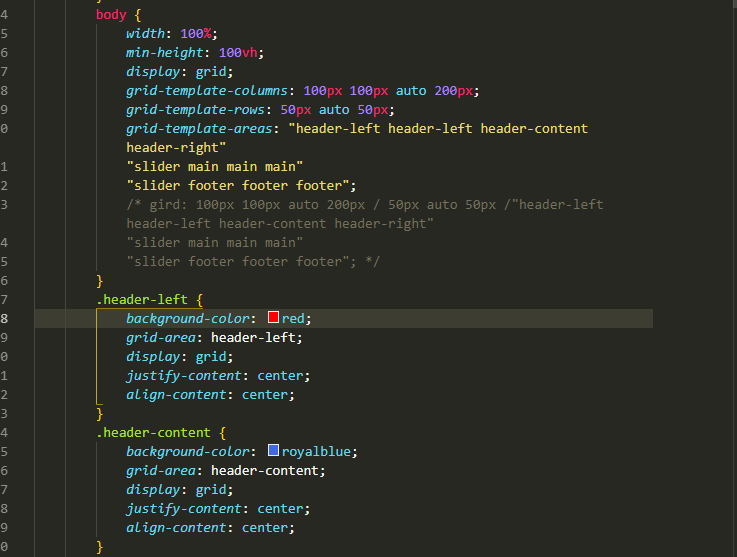

## flex与grid布局

### 前言
轮到我分享😂,才疏学浅，js实在找不到擅长并且还没讲的，讲下css布局吧，各位大佬多多包涵。
一下都是我自己的一些想法，有问题欢迎大家指正😘：

### 传统布局
* 传统的布局一般是指，之前比较常用的，用 display属性 + position属性 + float属性组合，实现我们想要的布局方式，但是一些特殊的布局以及写法，比如不定高的垂直居中，不是很方便，比如用float需要清除浮动，使得我们经常需要封装一些不必要的css代码。
* 据说还有传说中用table的布局方式，额没去了解过。

### flex布局

1. flex布局大家应该都比较熟悉了，兼容性方面到现在2019年。。。前一周那肯定没什么问题。
2. flex 主要围绕**轴**的思维来的，是一维的方向的布局。分为主轴和副轴，类似数学里面坐标系的x与y轴，其中主轴代表子元素排列的方向，副轴代表。。。另外一个方向。
3. 特别是对于不同屏幕的尺寸，都可以很好的实现自适应。

[flex布局语法请点这里](http://www.runoob.com/w3cnote/flex-grammar.html)

### flex布局优点
1. 我最大的感受是用flex布局时，开发速度快，大部分时候只注重写代码，并不需要考虑尺寸，基本用padding，margin都可以搞定， 各种方向的对其非常方便，👍
2. 基本能胜任所有情况，搭配css3其他属性基本可以做到完全不要js处理布局问题。👍
3. 对一些不定尺寸的排列比较友好。👍
**op布局实例**

### gird布局
1. gird布局是目前最强大的，基于网格的布局系统。
2. 相比于一维的flex布局，gird是二维的，可以将每一个网格进行定义，让你在可以在网格任意位置放置，而不是向flex一样只能由排列，然后换行的方式挤过去，想要在特定的位置，需要盒子套盒子。
3. 发现gird的语法与flex的语法有很多相似之处，很容易接受，并且可以对边框，边距等进行设计。
4. 网格的思维使得我们可以着眼于全局，在整个页面中，在什么位置，更好的规划，布局😱。
5. 问题来了，gird最大的问题就是浏览器兼容性问题，google浏览器直到57版本才开始支持gird，也就是17年3月的版本，其他我都没去查，呐，结论就是我们现在并不能在业务中使用🤬🤬🤬。

[gird布局详细教程请点这里](https://cloud.tencent.com/developer/article/1186773)
**op布局实例**

### gird布局优点
1. 操作简单，书写方便，拿到设计图思路更加清晰更好规划，想怎么布局就怎么布局。
2. 可以设置flex不能涉及的边距等内容。
2. 对已知的元素可进行很快速的布局，但是对于还未知数量不定尺寸的元素不是很友好。

### 总结
1. **flex布局**：目前最合适的布局方案，来来来，大家都用flex吧，浮动可以忘记了，定位（除了需要脱离文档流丢到某个位置）也可以不要了，配合一些css3另外一些强大的模块，以后js只需要写逻辑了。
2. **gird布局**：更加适合整个网页的布局，多个模块的布局。目前可以用来装X😛，过几年再用。
3. 将flex与gird布局结合使用，可能会是最好的方案😻。