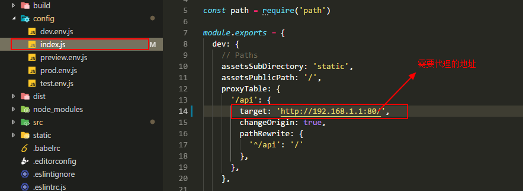
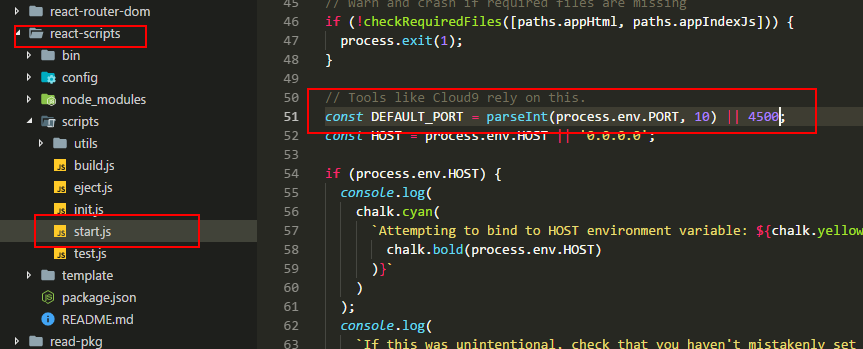

## 初衷
嗯，作为一个react小白，前几天用webpack搭建react环境，弄得头大，还有问题没解决。
    所以我决定先学习react，最好的方式就是用脚手架搭建好，直接，快速的学习react。此文章只讲用法不涉及原理什么的

#### 开始
1. 嗯，git瞄了一眼react-create-app的star最多，嗯就是你了， 那就引入。
    ```
    npm install -g create-react-app
    ```
2. 生成项目。
    ```
    create-react-app react-cli
    cd react-cli/
    ```
3. 然后npm start
    默认情况下，会在开发环境下启动一个服务器，监听在3000端口。
    是的你没看错，这就可以看到效果了，真的是我用过的最简单的搭建方式。
     

4. 以前用vue-cli的时候的webpack提供的主要功能都实现了。比如热更新，比如自动启动浏览器，比如 npm run build 而且还有eslint 但是是否能配置，怎么配置还要研究一下。

5. 之前用webpack时候，webpack搭建的node服务，解决跨域方式：
    

    create-react-app提供了一个超级简单的方法，只需要在package.json文件中，加一个配置项就可以了。
    ```
      "proxy": "http://localhost:3001/"
    ```
#### 服务端搭建（模拟接口）
  node忘完了,这里我只能借助json-server这个工具快速搭建后台管理系统的服务端程序：
1. 安装
    ```
    npm i json-server -g
    ```
2. 新建目录
    根目录下新建一个server目录。server下建要用的json文件比如index.json,然后写入数据。
    
#### 路由
1. 安装
    ```
      npm install react-router-dom --save
    ```
2. 新建文件,配置路由。

#### sass的引入
1. 安装
    ```
       npm install sass-loader node-sass --save-dev
    ```
2. 进行配置，因为create-react-app是基于webpack的所以配置方式和webpack差不多。
    ```
       找到node_modules/react-scripts/config/webpack.config.dev.js文件和webpack.config.prod.js文件，两个文件都要
       将其中modulep配置项中最后一个替换成
        {
            loader: require.resolve('file-loader'),
            // Exclude `js` files to keep "css" loader working as it injects
            // it's runtime that would otherwise processed through "file" loader.
            // Also exclude `html` and `json` extensions so they get processed
            // by webpacks internal loaders.
            exclude: [/\.js$/, /\.html$/, /\.json$/,/\.scss$/],
            options: {
                name: 'static/media/[name].[hash:8].[ext]',
            },
        },
        {
            test: /\.scss$/,
            loaders: ['style-loader', 'css-loader', 'sass-loader'],
        }
    ```
    ok，就可以在create-react-app中愉快的使用scss了。
