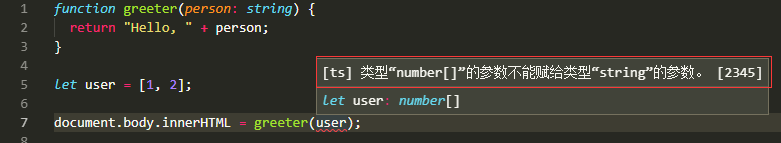

## 基础-编译器
* 其实就是用我们安装的compiler，再利用命令行执行
```
  tsc gtrrter.ts(文件名)
```
## 基础类型
* 在typescript中，我们定义一个变量时候需要确定它的类型例如：
```
  布尔
  let isDone: boolean = false;

  不同进制数字：
  let decLiteral: number = 6;
  let hexLiteral: number = 0xf00d;
  let binaryLiteral: number = 0b1010;
  let octalLiteral: number = 0o744;

  字符串：
  let name: string = "bob";

  模板字符串：
  let name: string = `Gene`;
  let age: number = 37;
  let sentence: string = `Hello, my name is ${ name }`;

  数组
  let list: number[] = [1, 2, 3];
  let list: Array<number> = [1, 2, 3];（Array<元素类型>）;

  元组Tuple
  let x: [string, number];（）；

  枚举enum（理解了在写）；

  Any（编程阶段还不清楚类型的替代，最后赋值时候再自动更改类型）；
  let notSure: any = 4;
  notSure = "maybe a string instead";
  notSure = false; // okay, definitely a boolean

  Object（非原始类型）
  declare function create(o: object | null): void;
  create({ prop: 0 }); // OK
  create(null); // OK
  create(42); // Error
  create("string"); // Error
  create(false); // Error
  create(undefined); // Error
```

* 类型断言，表示确定自己的类型是对的，也就是忽略typescript的对类型的诊断等。
```
1. 尖括号
  let someValue: any = "this is a string";

  let strLength: number = (<string>someValue).length;
2. as语法
  let someValue: any = "this is a string";

  let strLength: number = (someValue as string).length;
```
## 类型注解
* 按照官网上面的例子，我的理解就是**我们可以在定义函数时的参数给参数限定类型**,如果之后调用时候没符合限定的类型会报错。一下是VS code报错情况。

