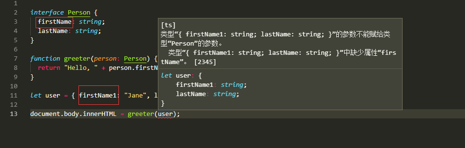
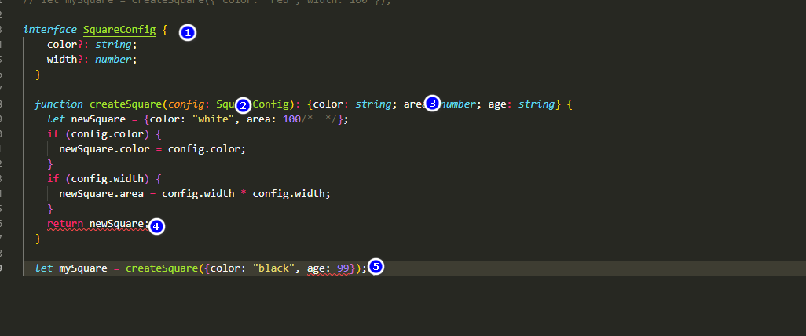

## 接口
* 目前理解：大概就是吧类型注解扩展，，意思就是我们我们可以把需要传入的参数定义到一个对象中。我们后来传入的时候需要符合对象中规定的类型。例如最基础的：


* 可选属性，表示有些条件下存在，定义方式是在属性名后面加问号;例如：color?:string;
* 只读属性，顾名思义只能在刚创建时候修改器值。方式是在前面加readonly例如：readonly color: string

## 一个错误例子：

* 首先看到文档上的这样的写法我是懵逼的，多出来一个3号，没懂作用是什么，文档之前也没有写过这种写法。经过实验发现，其是作用是规定函数返回值内容的格式，就是 newSquare 。
* 上面有两个报错，详细说明.
```
    1. 标号为5的报错，这个错就是因为我们在1这里规定不能传这两个之外的，所以报错。
    2. 4号错，就是上面提到的，3号规定里面定义的返回值必须包含这三个，但是现在少一个（可多不可少）。
```
## yes:

