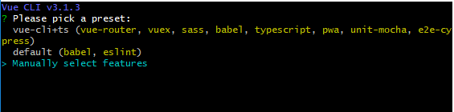
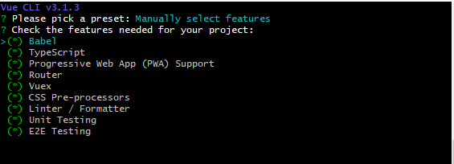
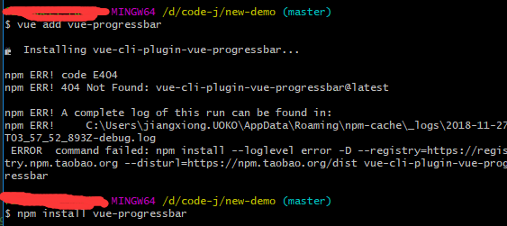
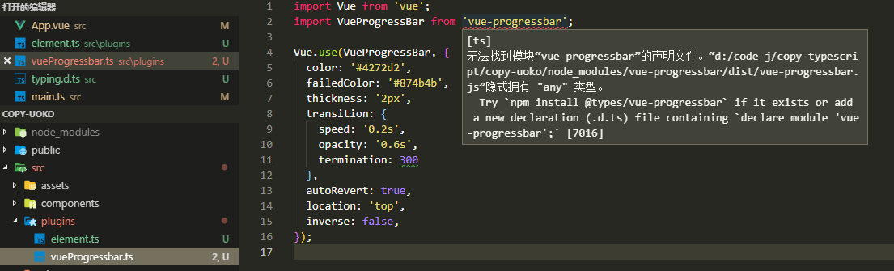

## vue-cli3.0+typescript 的搭建

### 公司目前转型用typescript，目前在学习阶段，记录下搭建时候遇到的问题。

### 基础
* 首先肯定是安装
> npm install @vue/cli
> vue -V(大写)
* 创建一个新项目：
> vue create new-demo (注意window用gitbush时候必须用winpty vue.cmd create hello-world才会有交互出现)

> 键盘a全选反选，123456这些分别对应某个，并且键盘其他的按键也有一些对应，有点蒙蔽，jk对应上下。
> 然后就是一个一个选择一些需求了，比如css预处理器，比如测试用框架
* 然后安装必要插件**现在可以直接用vue add name** 来下载插件

### 问题概述
1. 引入问题
    * 现在是复刻之前项目，用到了进度条vue-progressbar，因为是ts所以出现问题
    
    这边不支持用3.0的命令，所以还是要像以前一样install，自己引入。
    * 然后问题又来了。这次是ts报错问题。
    
    所以我们这边

2. 插件问题.
> elementui 迎合了3.0的更改 
> 直接vue add element（window用gitbush时候必须用winpty vue.cmd add element才会有交互出现选择按需加载还是全部） 就会自动帮忙下载一个vue-cli-plugin-element,然后就可以正常安装，安装以后什么都不用管，引用都写好了。。。
> 安装axios和vue-axios