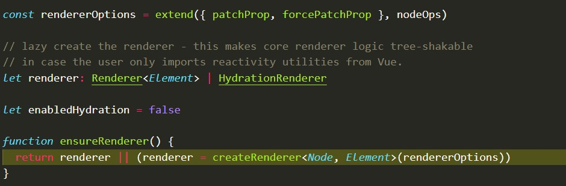

<!--
 * @Author: 蒋承志
 * @Description: file content
 * @Date: 2021-02-19 14:18:23
 * @LastEditTime: 2021-02-20 19:13:36
 * @LastEditors: 蒋承志
-->

# vue3.0 第一部分创建的大概流程

## 从创建应用开始

1. 首先肯定是利用Vue.createApp创建一个app实例

2. ensureRenderer是一个单例模式的函数，会返回一个renderer，如果无renderer则会调用createRenderer进行获取renderer，获得了一个app实例；
3. dev环境下注册一个方法：isNativeTag，挂载到app.config下面, 会区分html标签和svg标签；
4. 获取到实例的mount方法，并保存下来；
5. 重写mount方法
6. 返回实例

## 核心第一部分、创建实例和容器

1. ensureRenderer函数查看是否有renderer没有则创建一个，传入的rendererOptions

rendererOptions主要包含patchProp（补丁属性），forcePatchProp（强加补丁属性）和nodeOps（节点的操作选项之类的）

1. createRenderer返回baseCreateRenderer函数，那么核心就是baseCreateRenderer了

baseCreateRenderer函数里面有超级多个函数，1800多行.

最后返回三个函数，createApp通过调用createAppAPI来获取，createAppAPI直接返回一个createApp函数就是之前ensureRenderer调用的那个

主要就是创建一个相关的容器，包括一些app的基础属性uid啥的，其中context是由createAppContext函数执行，

此函数主要是初始化一个环境，此环境，可以看到里面包含mixins、directives等说明这些和生命周期等不是同一个维度，

**此时的app属于Vue的一个准备阶段，为后面的mount等操作准备好了所需要使用到的函数。**

## 核心第二部分、mount

最核心(繁琐)的操作都在mount里面,这里面包括Vnode，render，patch等等所有的核心功能。后面的一些操作相关的无非就是各种组合循环使用，mount的调用流程，额今天懒得看看的写了 **请看下篇**
